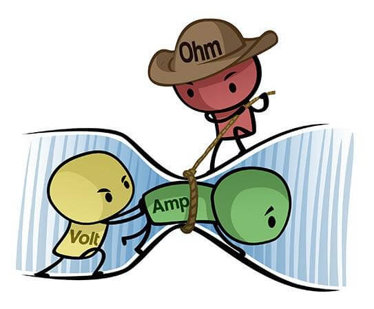
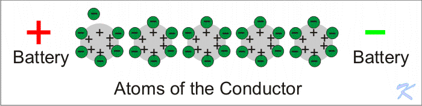
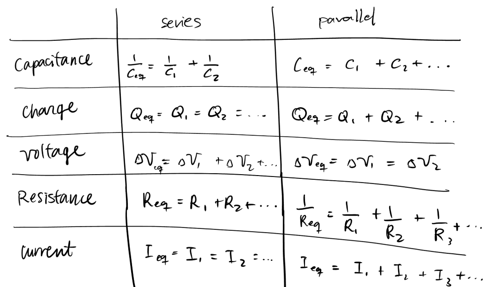

## Definitions to keep in the back of your head
* Electric charges
    * Positive or negative or neutral
    * Like repel, unlike attracts each other 
* Energy is the ability to do work → our focus is Electrical Energy
    * What is the work in Electrical Energy? Moving electrons through a material (usually wire)
* Conductors
    * Electrons can move freely → current flows
    * Most conductive is silver but copper is cheaper and more abundant
* Insulators 
    * Electrons can not move freely → current does not flow
* Semiconductors
    * As the name may have well suggested it is an in-between of conductors and insulators
    * Metalloids doped with impurities allows for “movement of electrons and holes”
* Circuit
    * Closed path allowing continuous flow of electrons from one point to another

## Never forget Ohm’s Law V=IR and P=VI

* I = Current (Amps) = flow of charge
* But conventional current flows opposite, from positive to negative
    * People never bothered to fix this 
* V = Voltage (Volts) = potential energy difference between 2 points on circuit
    * It is what makes the charge move
* R = Resistance (Ohms) = restricts flow of charge
* P = Electric Power (Watts) = rate at which energy is transferred/used
    * The more power, the more energy (and unfortunately the more money)
    * Here is a [Sparkfun video](https://www.youtube.com/watch?v=p8JQTLkV5C8) 
    

## Voltage Range and Current Requirements

* Components have a specific voltage range
    * Lower than required voltage, component won’t power on
    * Too high, will most likely become nonfunctional, destroyed
* Current range is less specific
    * Power supply does not provide enough Amps needed, voltage drops and brownouts problems
    * If the power supply provides more Amps than component’s rated, just fine 
        * Component takes what it needs
* Components like motors have:
    * __No load current:__ min current needed to start the motor without anything attached to it
    * __Nominal current:__ current needed for normal use, e.g. rover driving around
    * __Stall current:__ max current draw under edge conditions, e.g. the wheel got stuck but the motor keeps trying to rotate.

## Series and Parallel

* Voltage in parallel branches is the same
* Current across branches in series is the same
