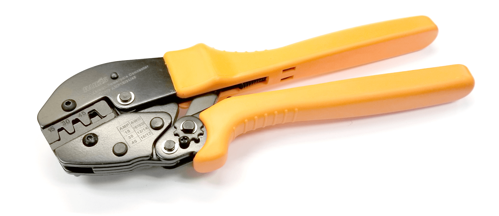

### Common Tools
* Wire cutter (flush cutter)

    

* Wire stripper
     
     

    * AWG = American Wire Gauge
    * Smaller number = bigger wire

   

* Ratcheting Crimper (Anderson, Dupont, and general)

    
    * Build those arm muscles 💪

* Soldering Iron
    
    

    * Join two components (usually wires) together
    * Good tutorial: https://www.youtube.com/watch?v=Qps9woUGkv
    * Use heat shrink tubing to insulate exposed conductor

* Heat Gun

    

    

    * Hot hair dryer to shrink heat shrink tubing

* Flathead screwdriver 
    * Always missing when you most need it

### Multimeter 101

* Measure Current, Voltage, Resistance, Continuity in AC and DC
* Make sure that you got the correct ports! 
* Make sure you have DC selected!
* COM and V ohm port
    * This configuration makes it so that the DMM has infinite resistance so current only flows through the branch of what is being measured
    * Measure branch in _parallel_
    * __Continuity:__ Checks for the presence of a complete path for current to flow
    * __Voltmeter:__ measures voltage
    * __Ohmmeter:__ measure resistance
* COM and A port
    * This configuration makes it so that the DMM has ideally no resistance so current flows through the ammeter to measure the branch’s current
    * Measure branch in _series_
    * __Ammeter:__ measures current

### Connectors
* Anderson connector

     
* Dupont connector

     
* XT90/XT60 connector

     
* Wago connector

     
    
    * Good for when there is no time to solder, but it is not a replacement for soldering
    * Good for quick testing

