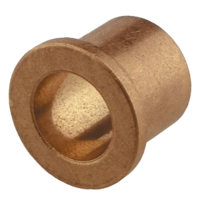

# Hardware
Overview of the most common hardware on the rover!
## Fasteners
### Bolts
> __Bolts__ are fasteners with externally threaded shafts. They fasten onto a nut or female-threaded hole. Bolts we use are typically tightened with a hexagonally-shaped key. 

In this image, a bolt mates with a __nut__ on the opposite side of the material to be fastened:

In this image, a bolt goes through a __clearance hole__ (a hole that the bolt slips through) on one plate and mates with a __tapped hole__ (a hole that has threads in it) on a second plate:

There are several important characteristics of bolts, including the system of measurement, naming, and head type.
* Metric vs Imperial: metric bolts use mm for dimensions, while imperial bolts use in for dimensions.
* Bolt sizing
    * Metric: `nominal diameter`-`pitch` x `length`.
        * e.g. M4-0.7 x 12 is a bolt with a 4mm diameter, 0.7mm between threads, and 12mm of length
    * Imperial: `major diameter`-`threads per inch` x `length`
        * e.g. 1/4-20 x 1/2" is a bolt with 1/4" diameter, 20 threads per inch, and 1/2" of length
    * As you work, you will begin to memorize these useful dimensions for imperial bolts:

* Head Types:
    * Button Head: Used for standard load applications. Most common.
    * Socket Head: Used for high load applications. Taller head and bigger hex size allows for more torque to be applied when tightening, but requires more clearance.
    * Flat Head (CounterSunk): Used when little clearance is available for a head. Requires countersink drill bit.

* Loctite
    * Loctite threadlocker is a liquid or gluestick that you rub on the threads of the bolt before fastening onto a tapped hole (not on nuts). It then expands and solidifies to fill the gap between the threads, friction-locking the bolt in place.
    * You should always use loctite on final assembly because screws can loosen and fall out due to vibration.
    * When adding loctite, check if there is already old loctite (white crust) on the bolt. If so, clean off the bolt before reapplying to ensure the new loctite has clean threads to tighten.
    * In almost all cases, blue loctite is good enough (there are stronger versions like red that make the bolt very difficult to remove)
    * __NOTE:__ Do not use loctite for any bolt that fastens through plastic--the fumes released may crack/weaken the plastic. Use super glue instead if necessary.

Advanced Topics

<ul>
    <li>Coarse threads vs fine threads</li>
    <li>Screw Clearances</li>
    <li>Imperial bolt sizing numbers</li>
    <li>Bolts vs Screws?</li>
    <li>More kinds of bolts</li>
    <li>More loctite!</li>
</ul>

### Nuts
> __Nuts__ are fastening elements used in conjunction with screws.

There are many different types of nuts for different applications. Some of these are listed:
* Hex Nuts: general purpose nut
* Lock Nuts: a nylon insert compresses when the bolt is fastened, "locking" the nut in place. _most commonly used_
* Flange Nuts: a flange distributes pressure, so you don't need a washer
* Thumb Screws: wings allow tightening and loosening by hand

### Rivets
> __Rivets__ are permanent fasteners that work by squeezing two items teogether by forcefully crushing metal. They are used when you can only access one side of the material, and are very easy to use with the right tools.

There are several important parts of a rivet:

* Rivet pin: important features are diameter and grip length. Grip length determines how thick the material that you are fastening together can be.
* Head: the head can be dome-headed (similar to button-headed bolts) or flush-headed (similar to flat-headed bolts)
* Mandrel: there are different mandrel diameters for different strengths of rivets, and they need a specific attachment on the riveting tool

Rivets can be "drilled out" and replaced using a drill bit that corresponds to the diameter of the rivet pin

### Washers
> __Washers__ are used to distribute the load of tightening a bolt over a wider area, allowing the bolt to be more strongly tightened without damage to the surface. Especially important for plastic.
>> Note: flat washers (most common) have a flat side and a rounded side--the flat side goes to the material and the rounded side goes to the bolt

There are many different kinds of washers that you can look up for more info--some are shown in the image below:

## Rotary Motion
### Shafts and Spacers
> __Shafts__ are used everywhere for rotary transmission. The most common for our use are __roundshafts__ and __hex shafts__.
>> __Spacers__ are just cylinders that keep distance between two elements on a shaft. They're typically nylon plastic.

### Gears
> __Gears__ are one of the most basic pieces of rotary transmission hardware. They are used to swap rotation direction and in gearboxes for reducing speed/increasing torque.

There are a few important characteristics about gears:
* Tooth Count: How many teeth there are, needed for gear ratios.
* Pitch Diameter: Important for designing gears to mesh. Essentially, if the pitch diameters of two gears are tangent to one another, then the gears will mesh properly.
* Outer Diameter: The diameter of the whole gear.
* Center Distance: The distance between the centers of the gears.

Advanced Topics

Another important feature of gears is Diametral Pitch (DP), which is the ratio of the number of teeth to the pitch diameter--higher DP allows you to fit gears in tight spots.
    
Technically, the gear shown in the picture above is a <strong>spur gear</strong>. However, there are many other useful types of gears:
<ul>
    <li><a href="https://en.wikipedia.org/wiki/Bevel_gear">Bevel Gears</a>: Used for 90 deree rotational transmission. A bevel gear with a 1:1 ratio is called a <strong>miter gear</strong>.</li>
    <li><a href="https://www.iqsdirectory.com/articles/gear/worm-gears.html">Worm Gears</a>: While <strong>spur gears</strong> can cause a lot of <a href="https://en.wikipedia.org/wiki/Backlash_(engineering)">backlash</a>, worm gears are great for reducing backlash and smooth motion, as well as big gear reductions and quieter operation.</li>
    <li><a href="https://en.wikipedia.org/wiki/Rack_and_pinion">Gear Racks (aka Rack and Pinion)</a>: Simple mechanism used to convert rotational motion to linear motion via gears.</li>
    <li><a href="https://www.differencebox.com/engineering/difference-between-helical-gear-and-herringbone-gear/">Helix and Herringbone Gears</a>: <strong>Helical gears</strong> have teeth angled in a helix, resulting in more teeth contact and stronger power transmission, with side effect of some axial thrust force. <strong>Herringbone</strong> gears also have angled teeth, but they are shaped like a V so that the axial thrust forces cancel each other out. A Herringbone gear is a solid choice for 3D printed gears, as it gives more tooth contact and is quieter.</li>
</ul>

### Bearings and Bushings
> __Bearings__ are commonly used to minimize the friction of a spinning shaft. An important feature of both bearings and bushing is whether or not they are __flanged__.

There are several different kinds of bearings that we've used commonly:

* Ball Bearings
    * The shaft that spins goes in the middle and turns with the inner race.

* Needle Roller Bearings
    * Used for large shafts, where a ball bearing would get too big and heavy.

* Thrust Bearings
    * Used where two faces rotate against each other.

> __Bushings__ are similarly used to minimize friction but have no moving elements and are _used for low speeds of rotation_. They are simply a low-friction cylinder made by injecting lubricant into metal somehow.

### Lead Screws
> __Lead screws__ are essentially long bolts that are used to convert rotational motion to linear motion.

Advanced topics

(click links on certain key words for more info)

Some lead screws are [__back-driveable__](https://www.pbclinear.com/Blog/2018/February/What-is-Lead-Screw-Efficiency-in-Linear-Motion#:~:text=What%20is%20Back%20Driving%3F), i.e. when a linear force is applied, the nut will turn and move backwards. Other lead screws are not back-driveable because the friction force increases faster than the torque to turn. Because a lead screw is essentially an inclined plane, back-driveability is analagous to the [__angle of repose__](https://en.wikipedia.org/wiki/Angle_of_repose#:~:text=This%20free%20body%20diagram%20demonstrates%20the%20relationship%20between%20angle%20of%20repose%20and%20material%20on%20the%20slope.) of an object on an inclined plane. Back-driveability is related to the [__helix and lead angle__](https://fractory.com/lead-screws/#:~:text=Helix%20and%20lead%20angle) as well as the [__efficiency__](https://www.helixlinear.com/blog/lead-screws/lead-screws-vs-ball-screws-which-will-work-best-for-your-application/#:~:text=Efficiency%20in%20linear,the%20screw%20thread.) of the lead screw because efficiency is related to losses of friction.

Lead screws have several different types of [__thread profiles__](https://fractory.com/lead-screws/#:~:text=obtain%20the%20lead.-,Types%20of%20Lead%20Screw%20Threads,-Lead%20screws%20are), and these affect strength, precision, and back-driveability.

Lead screws can have more than one [__start__](https://www.thomsonlinear.com/en/support/tips/difference-between-screw-pitch-and-lead), meaning there are multiple individual threads running along the length of the shaft. More starts means more __lead distance__ (distance traveled/revolution).

[__Ball screws__](http://www.barnesballscrew.com/how-a-ball-screw-works/) are an alternative to lead screws that use actual balls (similar to ball bearings) to travel, decreasing friction and increasing back-driveability.

### Retaining Rings and Shaft Collars
> __Retaining rings__ are a low-profile solution put on the end of a shaft to stop the shaft from falling out the other way.

There are two most common kinds of retaining rings: snap rings and e-clips. They fit into a groove on the shaft of specified width and diameter.

> __Shaft Collars__ are a high-profile and strong clamp to stop the shaft from falling out. They commonly use bolts or __set screws__ (a fully threaded screw with no head cap) to clamp.

_Documented by Micah Hsu_