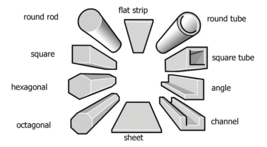

## Stock
Materials come in many different shapes and sizes, some of the most common that we've used are listed:
* Sheet: Flat sheet of material, used for machining plates
* Box Tube: A tube whose cross-section is a rectangular box, used on the chassis and for other structures
* Tube: A tube whose cross-section is a circle, good for torsional rigidity.
* L Channel: Imagine taking a sheet and bending a 90 degree angle in it.
* U Channel: A tube whose cross-section looks like a U.

## Materials
* Aluminum: Our most common manufacturing material. We use 6061-T6 aluminum, which is strong, cost-effective, and easy to machine.
* Steel: Much stronger but much heavier, and harder to machine than aluminum. Doable on the shapeoko, but we've only used it once that I know of lol.
* Carbon Fiber: Very strong and very light, but very expensive and hard to machine correctly. We used this on Osiris' chassis and it held up well except for the differential bar (though that shouldn't have broken, nice little story about that apparently). It has great tensile strength but not so great torsional strength, depending on what type you get. Carbon fiber is anisotropic, meaning it's stronger in certain directions, i.e. the directions that the fibers are laid. When machining, any modifications to the carbon fiber (holes, cuts, etc.) should be patched with epoxy, otherwise it will be significantly weaker. When machining, the tiny fibers can also get stuck in your hands and lungs, so be careful haha.
* Fiberglass: Like carbon fiber, fiberglass (we used garolite) has a high strength-to-weight ratio, though weaker and cheaper than carbon fiber. It's also anisotropic and can be lowkey bad to inhale.
* Delrin: A very low-friction plastic that's a great in-between for metals and 3D prints. It's stronger than 3D prints and lighter than metal, but needs to be machined. We will probably use these in cycloidal gearboxes.

_Documented by Micah Hsu_