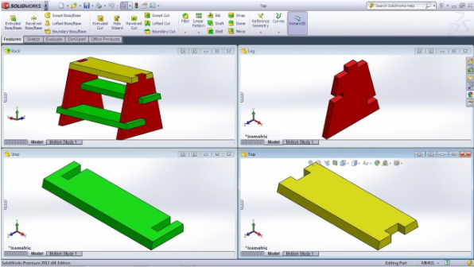

## Introduction
SC Robotics uses the industry-standard design software called SolidWorks to design our rover each year. A 3D model is very useful because it acts as an instruction manual for manufacturing, assembly, and electrical layout.

The application of 3D design are numerous--Mechanical Engineering, Aerospace Engineering, Architecture, Game Design. For engineers (especially mechanical!), it's a baseline skill to have.

## Design Process Overview
In SolidWorks, there is typically a two or three-step design process at the highest level: `Part` -> `Assembly` -> `Drawing`

* Part: We start by designing a bunch of individual parts that are single pieces
* Assembly: After we have all the parts, we __mate__ them together to model the mechanism
* Drawing: We can create drawings of parts and assemblies to help with manufacturing and assembly

## Always Use Hole Wizard! :hole::mage:
Aside from the features that were demonstrated in the tutorials above, Hole Wizard is probably the next most important feature that you'll ever use. It creates standard-sized holes for you so you never have to remember hole diameters or anything of like that.

Follow [this tutorial](https://www.youtube.com/watch?v=cpfMU3pIVdk) to learn it!

:::note
Almost every hole should be made from Hole Wizard. If you are using Cut-Extrude to make a lot of your holes, something's wrong.
:::

:::tip
The most common Hole Wizard settings are:
1. For screw clearance holes: Hole Type: `Hole`. Standard: `ANSI Inch/Metric`. Type: `Screw Clearances`.
2. For screw tapped holes:  Hole Type: `Straight Tap`. Standard: `ANSI Inch/Metric`. Type: `Bottoming Tapped Hole`.
:::

## Naming Conventions
Names for every custom designed (non-commercial) CAD file should follow include the year _in two numbers_, subsystem _in three characters_, P or A for part or assembly, part/assembly number, and description. For example:
1. 21-AAA-A001-Rover.SLDASM
2. 21-CHS-P048-Bellypan.SLDPRT
3. 23-ARM-A001-Arm.SLDASM
4. 22-ARM-A002-Cycloidal Gearbox.SLDASM
5. 22-ARM-P002-Forearm Tube.SLDPRT

:::tip Renaming Files
To enable renaming, click Tools > Options > System Options > FeatureManager > Allow component files to be renamed from FeatureManager tree.

Right click on the file name in the feature tree and click rename. It’ll ask you if you want to temporarily rename, and click yes. When you save the file with the temporarily renamed document, it’ll ask you for confirmation to completely change the name on a popup dialog, and just confirm with default settings.
:::

## NEXT: Your First SolidWorks Parts!
Congratulations! You now know the 20% of SolidWorks that you'll use 80% of the time! HOWEVER, you need to _practice_. We'll practice with a bunch of challenge parts and assemblies. [SolidWorks Challenge](./SolidWorks%20Challenge.md)

_Documented by Micah Hsu_